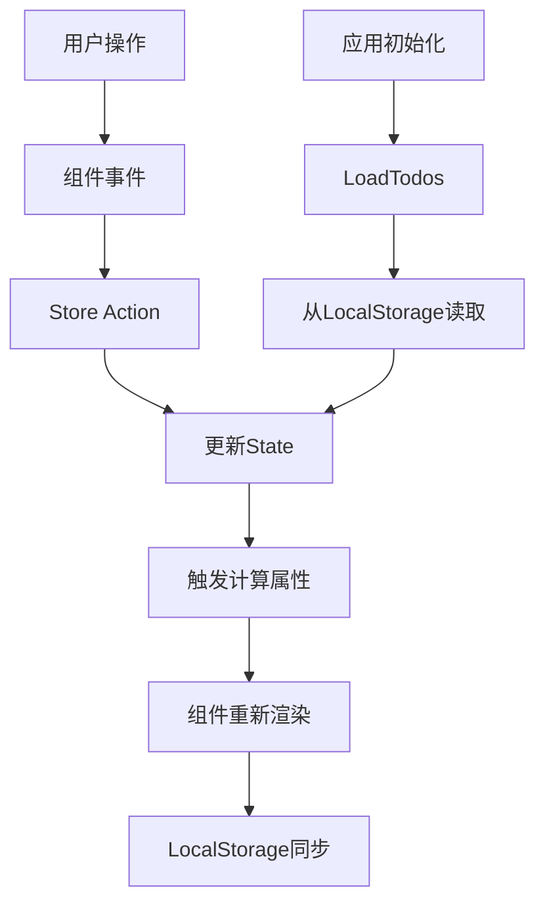
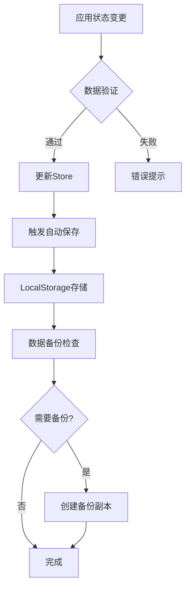

# Vue TodoList 应用设计文档

## 概览

这是一个基于Vue 3的简约风格TodoList应用，采用现代化的前端技术栈，提供完善的任务管理功能。应用注重用户体验，界面简洁优雅，交互流畅便捷。

### 技术栈
- **框架**: Vue 3 (Composition API)
- **构建工具**: Vite
- **状态管理**: Pinia
- **样式**: CSS3 + CSS变量
- **图标**: 自定义SVG图标
- **本地存储**: LocalStorage

### 核心特性
- 添加、编辑、删除任务
- 任务完成状态切换
- 任务优先级设置
- 任务分类管理
- 搜索和筛选功能
- 数据持久化存储
- 响应式设计
- 简约现代UI

## 技术栈与依赖

### 核心依赖
```json
{
  "vue": "^3.3.0",
  "pinia": "^2.1.0",
  "vue-router": "^4.2.0"
}
```

### 开发依赖
```json
{
  "vite": "^4.4.0",
  "@vitejs/plugin-vue": "^4.2.0",
  "sass": "^1.64.0"
}
```

## 组件架构

### 组件定义

#### 1. 根组件 (App.vue)
- **职责**: 应用入口，整体布局管理
- **状态**: 主题切换、全局加载状态
- **子组件**: TodoContainer

#### 2. 容器组件 (TodoContainer.vue)
- **职责**: 任务管理的主容器
- **状态**: 当前视图模式
- **子组件**: TodoHeader, TodoList, TodoFooter

#### 3. 头部组件 (TodoHeader.vue)
- **职责**: 应用标题、任务添加、搜索功能
- **Props**: 无
- **Events**: add-todo, search-change
- **状态**: 搜索关键词、新任务输入

#### 4. 任务列表组件 (TodoList.vue)
- **职责**: 任务列表展示和管理
- **Props**: todos, filter, searchKeyword
- **Events**: toggle-todo, delete-todo, edit-todo
- **子组件**: TodoItem

#### 5. 任务项组件 (TodoItem.vue)
- **职责**: 单个任务的展示和操作
- **Props**: todo
- **Events**: toggle, delete, edit, update-priority
- **状态**: 编辑模式、临时编辑内容

#### 6. 底部组件 (TodoFooter.vue)
- **职责**: 统计信息、筛选控制、批量操作
- **Props**: todoCount, completedCount
- **Events**: filter-change, clear-completed
- **状态**: 当前筛选模式

#### 7. 优先级选择器 (PrioritySelector.vue)
- **职责**: 任务优先级设置
- **Props**: value, size
- **Events**: change
- **状态**: 当前选择值

#### 8. 分类标签 (CategoryTag.vue)
- **职责**: 任务分类标签展示
- **Props**: category, editable
- **Events**: change, delete
- **状态**: 编辑模式

### 组件层次结构

```
App.vue
└── TodoContainer.vue
    ├── TodoHeader.vue
    │   ├── AddTodoForm.vue
    │   └── SearchBox.vue
    ├── TodoList.vue
    │   └── TodoItem.vue
    │       ├── PrioritySelector.vue
    │       └── CategoryTag.vue
    └── TodoFooter.vue
        └── FilterTabs.vue
```

### Props/State管理

#### TodoItem组件示例
```typescript
interface Todo {
  id: string
  content: string
  completed: boolean
  priority: 'low' | 'medium' | 'high'
  category: string
  createdAt: Date
  updatedAt: Date
}

// Props
interface TodoItemProps {
  todo: Todo
  readonly?: boolean
}

// Events
interface TodoItemEvents {
  toggle: (id: string) => void
  delete: (id: string) => void
  edit: (id: string, content: string) => void
  updatePriority: (id: string, priority: string) => void
}
```

### 生命周期方法/Hooks

#### 主要Composition API使用
```typescript
// TodoContainer.vue
export default defineComponent({
  setup() {
    const todoStore = useTodoStore()
    const searchKeyword = ref('')
    const currentFilter = ref('all')
    
    // 初始化数据加载
    onMounted(() => {
      todoStore.loadTodos()
    })
    
    // 数据变化时保存
    watchEffect(() => {
      todoStore.saveTodos()
    })
    
    return {
      todoStore,
      searchKeyword,
      currentFilter
    }
  }
})
```

### 组件使用示例

```vue
<!-- TodoContainer.vue -->
<template>
  <div class="todo-container">
    <TodoHeader 
      @add-todo="handleAddTodo"
      @search-change="handleSearch"
    />
    
    <TodoList 
      :todos="filteredTodos"
      :filter="currentFilter"
      :search-keyword="searchKeyword"
      @toggle-todo="handleToggleTodo"
      @delete-todo="handleDeleteTodo"
      @edit-todo="handleEditTodo"
    />
    
    <TodoFooter 
      :todo-count="activeTodoCount"
      :completed-count="completedTodoCount"
      @filter-change="handleFilterChange"
      @clear-completed="handleClearCompleted"
    />
  </div>
</template>
```

## 路由与导航

### 路由配置
```typescript
const routes = [
  {
    path: '/',
    name: 'Home',
    component: TodoContainer,
    meta: { title: 'TodoList' }
  },
  {
    path: '/archive',
    name: 'Archive',
    component: TodoArchive,
    meta: { title: '已完成任务' }
  },
  {
    path: '/settings',
    name: 'Settings',
    component: TodoSettings,
    meta: { title: '设置' }
  }
]
```

### 导航结构
- 主页 (`/`) - 主要任务管理界面
- 归档页 (`/archive`) - 已完成任务查看
- 设置页 (`/settings`) - 应用设置和偏好

## 样式策略

### CSS架构
- **CSS变量**: 统一主题色彩和尺寸
- **BEM命名**: 组件样式组织
- **响应式设计**: 移动端适配
- **动画过渡**: 流畅的交互反馈

### 设计系统
```css
:root {
  /* 主色调 */
  --primary-color: #2563eb;
  --primary-hover: #1d4ed8;
  
  /* 中性色 */
  --gray-50: #f9fafb;
  --gray-100: #f3f4f6;
  --gray-200: #e5e7eb;
  --gray-300: #d1d5db;
  --gray-400: #9ca3af;
  --gray-500: #6b7280;
  --gray-600: #4b5563;
  --gray-700: #374151;
  --gray-800: #1f2937;
  --gray-900: #111827;
  
  /* 语义色 */
  --success-color: #10b981;
  --warning-color: #f59e0b;
  --error-color: #ef4444;
  
  /* 间距 */
  --space-1: 0.25rem;
  --space-2: 0.5rem;
  --space-3: 0.75rem;
  --space-4: 1rem;
  --space-6: 1.5rem;
  --space-8: 2rem;
  
  /* 圆角 */
  --radius-sm: 0.25rem;
  --radius-md: 0.375rem;
  --radius-lg: 0.5rem;
  --radius-xl: 0.75rem;
  
  /* 阴影 */
  --shadow-sm: 0 1px 2px 0 rgb(0 0 0 / 0.05);
  --shadow-md: 0 4px 6px -1px rgb(0 0 0 / 0.1);
  --shadow-lg: 0 10px 15px -3px rgb(0 0 0 / 0.1);
}
```

### 组件样式示例
```scss
.todo-item {
  @apply flex items-center gap-3 p-4 bg-white rounded-lg shadow-sm border border-gray-200;
  
  &--completed {
    @apply opacity-60;
    
    .todo-item__content {
      @apply line-through text-gray-500;
    }
  }
  
  &__checkbox {
    @apply w-5 h-5 rounded border-2 border-gray-300 cursor-pointer transition-colors;
    
    &--checked {
      @apply bg-primary-color border-primary-color;
    }
  }
  
  &__content {
    @apply flex-1 text-gray-800 font-medium;
  }
  
  &__priority {
    @apply w-3 h-3 rounded-full;
    
    &--high { @apply bg-error-color; }
    &--medium { @apply bg-warning-color; }
    &--low { @apply bg-success-color; }
  }
  
  &__actions {
    @apply flex gap-2 opacity-0 transition-opacity;
  }
  
  &:hover &__actions {
    @apply opacity-100;
  }
}
```

## 状态管理 (Pinia)

### Store结构

#### Todo Store
```typescript
export const useTodoStore = defineStore('todo', () => {
  // 状态
  const todos = ref<Todo[]>([])
  const categories = ref<string[]>(['工作', '个人', '学习'])
  const filter = ref<FilterType>('all')
  const searchKeyword = ref('')
  
  // 计算属性
  const activeTodos = computed(() => 
    todos.value.filter(todo => !todo.completed)
  )
  
  const completedTodos = computed(() => 
    todos.value.filter(todo => todo.completed)
  )
  
  const filteredTodos = computed(() => {
    let result = todos.value
    
    // 应用筛选
    if (filter.value === 'active') {
      result = result.filter(todo => !todo.completed)
    } else if (filter.value === 'completed') {
      result = result.filter(todo => todo.completed)
    }
    
    // 应用搜索
    if (searchKeyword.value) {
      const keyword = searchKeyword.value.toLowerCase()
      result = result.filter(todo => 
        todo.content.toLowerCase().includes(keyword) ||
        todo.category.toLowerCase().includes(keyword)
      )
    }
    
    return result
  })
  
  // 操作方法
  const addTodo = (content: string, category = '个人', priority = 'medium') => {
    const todo: Todo = {
      id: generateId(),
      content,
      completed: false,
      priority,
      category,
      createdAt: new Date(),
      updatedAt: new Date()
    }
    todos.value.unshift(todo)
  }
  
  const toggleTodo = (id: string) => {
    const todo = todos.value.find(t => t.id === id)
    if (todo) {
      todo.completed = !todo.completed
      todo.updatedAt = new Date()
    }
  }
  
  const deleteTodo = (id: string) => {
    const index = todos.value.findIndex(t => t.id === id)
    if (index > -1) {
      todos.value.splice(index, 1)
    }
  }
  
  const editTodo = (id: string, content: string) => {
    const todo = todos.value.find(t => t.id === id)
    if (todo) {
      todo.content = content
      todo.updatedAt = new Date()
    }
  }
  
  const updatePriority = (id: string, priority: Priority) => {
    const todo = todos.value.find(t => t.id === id)
    if (todo) {
      todo.priority = priority
      todo.updatedAt = new Date()
    }
  }
  
  const clearCompleted = () => {
    todos.value = todos.value.filter(todo => !todo.completed)
  }
  
  const loadTodos = () => {
    const stored = localStorage.getItem('todos')
    if (stored) {
      todos.value = JSON.parse(stored)
    }
  }
  
  const saveTodos = () => {
    localStorage.setItem('todos', JSON.stringify(todos.value))
  }
  
  return {
    // 状态
    todos: readonly(todos),
    categories: readonly(categories),
    filter,
    searchKeyword,
    
    // 计算属性
    activeTodos,
    completedTodos,
    filteredTodos,
    
    // 方法
    addTodo,
    toggleTodo,
    deleteTodo,
    editTodo,
    updatePriority,
    clearCompleted,
    loadTodos,
    saveTodos
  }
})
```

### 状态数据流



## API集成层

### 本地存储服务
```typescript
class TodoStorageService {
  private readonly STORAGE_KEY = 'vue-todolist-data'
  
  saveTodos(todos: Todo[]): void {
    try {
      const data = {
        todos,
        timestamp: Date.now(),
        version: '1.0.0'
      }
      localStorage.setItem(this.STORAGE_KEY, JSON.stringify(data))
    } catch (error) {
      console.error('保存数据失败:', error)
    }
  }
  
  loadTodos(): Todo[] {
    try {
      const stored = localStorage.getItem(this.STORAGE_KEY)
      if (!stored) return []
      
      const data = JSON.parse(stored)
      return data.todos || []
    } catch (error) {
      console.error('加载数据失败:', error)
      return []
    }
  }
  
  exportTodos(): string {
    const todos = this.loadTodos()
    return JSON.stringify(todos, null, 2)
  }
  
  importTodos(jsonData: string): boolean {
    try {
      const todos = JSON.parse(jsonData)
      this.saveTodos(todos)
      return true
    } catch (error) {
      console.error('导入数据失败:', error)
      return false
    }
  }
}
```

### 数据同步策略
- **自动保存**: 状态变更时自动保存到LocalStorage
- **定期备份**: 每24小时自动创建数据备份
- **数据导入导出**: 支持JSON格式的数据迁移
- **版本控制**: 数据格式版本管理，向后兼容

## 测试策略

### 单元测试结构

#### 组件测试
```typescript
// TodoItem.test.ts
import { mount } from '@vue/test-utils'
import { createPinia } from 'pinia'
import TodoItem from '@/components/TodoItem.vue'

describe('TodoItem', () => {
  let wrapper: any
  let pinia: any
  
  beforeEach(() => {
    pinia = createPinia()
    wrapper = mount(TodoItem, {
      global: {
        plugins: [pinia]
      },
      props: {
        todo: {
          id: '1',
          content: '测试任务',
          completed: false,
          priority: 'medium',
          category: '工作',
          createdAt: new Date(),
          updatedAt: new Date()
        }
      }
    })
  })
  
  it('正确渲染任务内容', () => {
    expect(wrapper.text()).toContain('测试任务')
  })
  
  it('点击复选框触发toggle事件', async () => {
    await wrapper.find('.todo-item__checkbox').trigger('click')
    expect(wrapper.emitted('toggle')).toBeTruthy()
  })
  
  it('双击进入编辑模式', async () => {
    await wrapper.find('.todo-item__content').trigger('dblclick')
    expect(wrapper.find('input').exists()).toBe(true)
  })
})
```

#### Store测试
```typescript
// todoStore.test.ts
import { setActivePinia, createPinia } from 'pinia'
import { useTodoStore } from '@/stores/todo'

describe('Todo Store', () => {
  beforeEach(() => {
    setActivePinia(createPinia())
  })
  
  it('正确添加任务', () => {
    const todoStore = useTodoStore()
    todoStore.addTodo('新任务')
    
    expect(todoStore.todos).toHaveLength(1)
    expect(todoStore.todos[0].content).toBe('新任务')
    expect(todoStore.todos[0].completed).toBe(false)
  })
  
  it('正确切换任务状态', () => {
    const todoStore = useTodoStore()
    todoStore.addTodo('测试任务')
    const todoId = todoStore.todos[0].id
    
    todoStore.toggleTodo(todoId)
    expect(todoStore.todos[0].completed).toBe(true)
  })
  
  it('正确筛选活跃任务', () => {
    const todoStore = useTodoStore()
    todoStore.addTodo('任务1')
    todoStore.addTodo('任务2')
    todoStore.toggleTodo(todoStore.todos[0].id)
    
    expect(todoStore.activeTodos).toHaveLength(1)
    expect(todoStore.completedTodos).toHaveLength(1)
  })
})
```

### 测试工具配置
- **测试框架**: Vitest
- **组件测试**: Vue Test Utils
- **E2E测试**: Cypress
- **覆盖率**: c8
- **Mock工具**: vi (Vitest内置)

### 测试类型分类

#### 1. 单元测试
- 组件逻辑测试
- Store状态管理测试  
- 工具函数测试
- 服务类测试

#### 2. 集成测试
- 组件间交互测试
- Store与组件集成测试
- 路由导航测试

#### 3. E2E测试
- 完整用户流程测试
- 跨浏览器兼容性测试
- 性能测试

## 数据模型设计

### 核心数据类型

```typescript
interface Todo {
  id: string                    // 唯一标识符
  content: string              // 任务内容
  completed: boolean           // 完成状态
  priority: Priority           // 优先级
  category: string             // 分类
  createdAt: Date             // 创建时间
  updatedAt: Date             // 更新时间
  dueDate?: Date              // 截止日期 (可选)
  tags?: string[]             // 标签 (可选)
  description?: string        // 详细描述 (可选)
}

type Priority = 'low' | 'medium' | 'high'
type FilterType = 'all' | 'active' | 'completed'

interface Category {
  id: string
  name: string
  color: string
  icon?: string
}

interface TodoFilter {
  type: FilterType
  category?: string
  priority?: Priority
  searchKeyword?: string
  dateRange?: {
    start: Date
    end: Date
  }
}

interface AppSettings {
  theme: 'light' | 'dark' | 'auto'
  language: 'zh-CN' | 'en-US'
  autoSave: boolean
  notifications: boolean
  defaultCategory: string
  defaultPriority: Priority
}
```

### 数据验证

```typescript
import { z } from 'zod'

const TodoSchema = z.object({
  id: z.string(),
  content: z.string().min(1, '任务内容不能为空').max(200, '任务内容过长'),
  completed: z.boolean(),
  priority: z.enum(['low', 'medium', 'high']),
  category: z.string().min(1, '必须选择分类'),
  createdAt: z.date(),
  updatedAt: z.date(),
  dueDate: z.date().optional(),
  tags: z.array(z.string()).optional(),
  description: z.string().max(500, '描述过长').optional()
})

// 使用示例
const validateTodo = (todo: unknown): Todo => {
  return TodoSchema.parse(todo)
}
```

### 数据持久化策略

